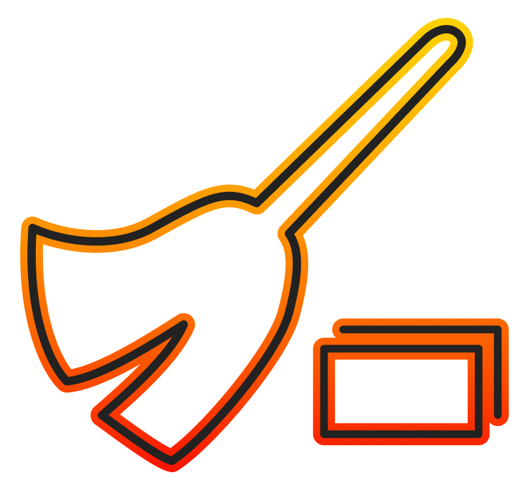

# TabJanitor

Clean up and manage your VS Code tabs with ease.

TabJanitor is a VS Code extension designed to enhance productivity by providing intuitive and flexible controls for managing your workspace's tabs. Whether you're dealing with a handful of files or navigating a sea of open tabs, TabJanitor makes it easy to stay organized and focused on your code.

## Features

- **Close Tabs to the Left**: Right-click on any tab to close all tabs to its left.
- **Close All But Pinned**: Close all tabs except the pinned ones.
- **Close All Except Current File Type**: Close all tabs that don't match the file type of the current tab.
- **Close All Tabs With Current File Type**: Close all tabs that match the file type of the current tab.
- **Close All Tabs From Same Directory**: Close all tabs from the same directory as the current tab.
- **Close All Tabs Without Changes**: Close all tabs without any unsaved changes.

## Installation

1. Open VS Code.
2. Go to Extensions by clicking on the square icon on the sidebar or pressing `Ctrl+Shift+X`.
3. Search for "TabJanitor".
4. Click on Install.

## Usage

After installation, right-click on any tab in your editor. You should see a "TabJanitor" submenu with all the features listed.

## Known Issues

- None at the moment. If you find any, please [report them here](https://github.com/jorrikklijnsma/TabJanitor/issues).

## Contributing

Pull requests are welcome. For major changes, please open an issue first to discuss what you would like to change.

## License

[MIT](./LICENSE)

## Changelog

For detailed changes for each version, check out [CHANGELOG.md](./CHANGELOG.md).
